# Mini Web Panel • Nginx + PHP-FPM (Raspberry Pi) V2 (MVC)

[](https://github.com/fay019/WebAdminPanel/releases/)
[](#)
[](#)
[](#)
[](#)
[](#)

Mini application PHP (sans framework) pour gérer les vhosts **Nginx** et sélectionner la version **PHP-FPM** par site.  
Cible: Raspberry Pi OS (Debian 12) en LAN, avec authentification obligatoire.

---

## 🤔 Pourquoi
- Simplifier la gestion des vhosts Nginx sans modifier les `.conf` à la main.
- Pouvoir basculer entre plusieurs versions de PHP-FPM (8.2 / 8.3 / 8.4).
- Offrir un **mini-cPanel LAN** pour Raspberry Pi sans surcouche lourde.

---

## ✨ Fonctionnalités principales
- CRUD complet sur les sites (vhosts Nginx)
- Sélection PHP-FPM par site (8.2, 8.3, 8.4)
- Vérifications automatiques (slug, server_name, root, conflits)
- Actions système: `nginx -t` + reload
- Éteindre / Redémarrer le Pi
- Gestion utilisateurs (CRUD + bcrypt)
- Sécurité: CSRF, sudoers limités, audit log

---

## ✅ Prérequis & installation de base (Debian 12)

Avant d’installer le panel, installez Nginx et PHP-FPM (8.2, 8.3, 8.4) :

```bash
# Mettez à jour votre système
sudo apt update && sudo apt upgrade -y

# Installer Nginx
sudo apt install nginx -y

# Ajouter le dépôt Sury pour PHP (versions récentes)
sudo apt install -y lsb-release ca-certificates apt-transport-https software-properties-common gnupg2
echo "deb https://packages.sury.org/php $(lsb_release -sc) main" | sudo tee /etc/apt/sources.list.d/php.list
wget -qO - https://packages.sury.org/php/apt.gpg | sudo apt-key add -
sudo apt update

# Installer PHP-FPM 8.2 / 8.3 / 8.4 + SQLite
sudo apt install -y php8.2-fpm php8.2-sqlite3
sudo apt install -y php8.3-fpm php8.3-sqlite3
sudo apt install -y php8.4-fpm php8.4-sqlite3
```

---

## 🚀 Installation du panel (v2)

1) Copier le projet sur le Pi (chemin recommandé: `/var/www/adminpanel`) :

```bash
sudo cp -r WebAdminPanel /var/www/adminpanel
```

2) Lancer l’installateur :

```bash
cd /var/www/adminpanel
sudo chmod +x install.sh
sudo ./install.sh --non-interactive || sudo ./install.sh
```

- L’install script déploie également les assets: `public/js/app.js`, `public/js/energy.js`, `public/js/php_manage.js`.
- Il installe la règle sudoers: `/etc/sudoers.d/adminpanel` (NOPASSWD sur ${PANEL_DIR}/bin/*).

3) Accéder au panel :
- URL: http://adminpanel.local/ (ou IP du Pi)
- Identifiants par défaut: **admin / admin** (à changer immédiatement !)

---

## 🔧 Configuration rapide (v2)
- PHP-FPM par défaut du panel: **8.3** (modifiable dans `install.sh`)
- Base SQLite: `data/sites.db`
- Logs: `logs/panel.log`
- Locales: `locales/fr|en|de|dz`

---

## 🛡️ Notes sécurité (middlewares)
- AuthMiddleware: redirige vers /login si non connecté (assets exclus)
- CsrfMiddleware: CSRF actif sur tous les POST (400 sinon)
- Sudoers: NOPASSWD sur `${PANEL_DIR}/bin/*` (installé via install.sh)
- Audit log → `logs/panel.log`

---

## ❓ Dépannage rapide (PhpManage & Nginx)
- Pas d’output install PHP → vérifier `/etc/sudoers.d/adminpanel` (sudo NOPASSWD) et les logs Nginx (`/var/log/nginx/error.log`)
- `php-fpm.sock` manquant → adapter le vhost généré
- Streaming figé → proxy buffering côté Nginx: s’assurer que `X-Accel-Buffering: no` est respecté et que `proxy_buffering off` sur l’upstream si applicable
- SQLite manquant →
  ```bash
  sudo apt install php8.3-sqlite3 && sudo systemctl restart php8.3-fpm
  ```  
- Binaire `bin/php_manage.sh` introuvable → vérifier que le chemin déployé est `/var/www/adminpanel/bin/php_manage.sh` (fallback `./bin/php_manage.sh`)

---

## 🧺 Publication GitHub
**À ne PAS committer** : `data/`, `logs/`, `*.db`, `*.sqlite*`, `*.log`, `*.old.*`  
**À committer** : code source, `bin/`, `public/`, `install.sh`, `locales/`, `lib/`, `README.md`

---

## 📂 Structure (v2 MVC)
```
public/index.php   # Front controller
app/Helpers/       # Router.php, Response.php, I18n.php
app/Controllers/   # DashboardController, PhpManageController, UsersController, ...
app/Services/      # PhpManageService, PowerService, SystemInfoService, ...
app/Views/         # layouts/, partials/, dashboard/, php_manage/, users/, errors/
config/routes.php  # Table de routage (inclut /php/manage et compat /php_manage.php)
public/            # CSS, JS (dont php_manage.js), images, erreurs
bin/               # Scripts CLI (nginx, php-fpm, sites, power, sysinfo)
data/              # SQLite (non versionnée)
logs/              # Journaux (non versionnés)
legacy *.php       # Entrées legacy gardées (ex: php_manage.php → 302)
```

---

## 📸 Captures d’écran (v2)

### Connexion
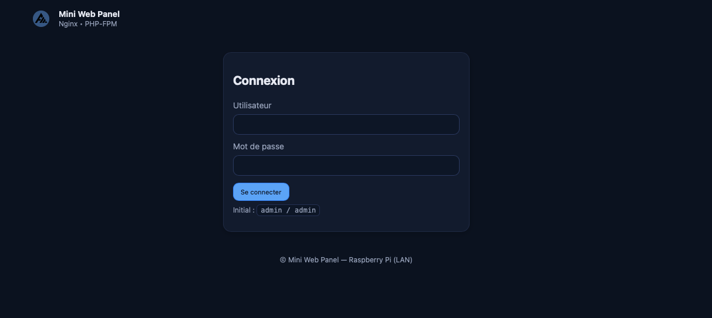

### Dashboard
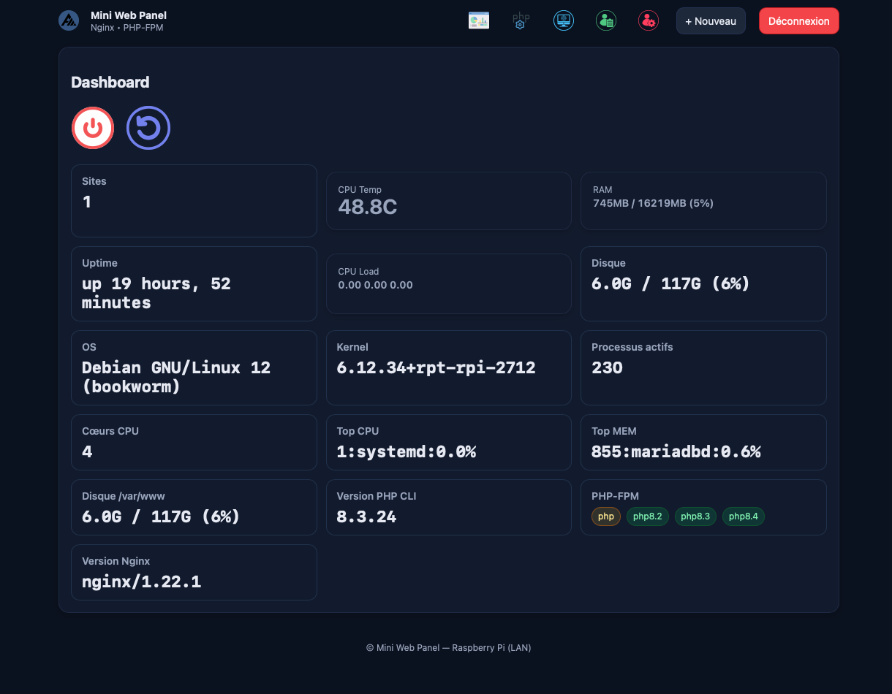

### Gestion PHP (module PhpManage)
- Routes:
  - GET /php/manage (liste) — remplace GET /php_manage.php (redirigé 302)
  - POST /php/manage/action (non-stream, flash)
  - POST /php/manage/stream (stream text/plain)
- Legacy compat:
  - GET /php_manage.php → 302 /php/manage
  - POST /php_manage.php → dispatch vers stream/action selon `ajax=1` ou `stream=1`
- JS: `public/js/php_manage.js` gère l’overlay live log (#busyOverlay/#busyLog)
- Ajout d’une version PHP  
  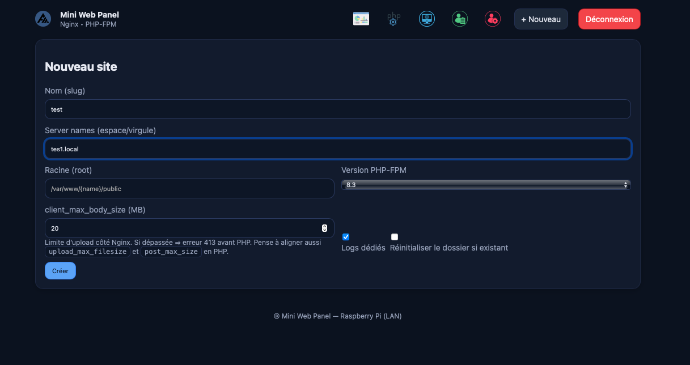
- Versions détectées  
  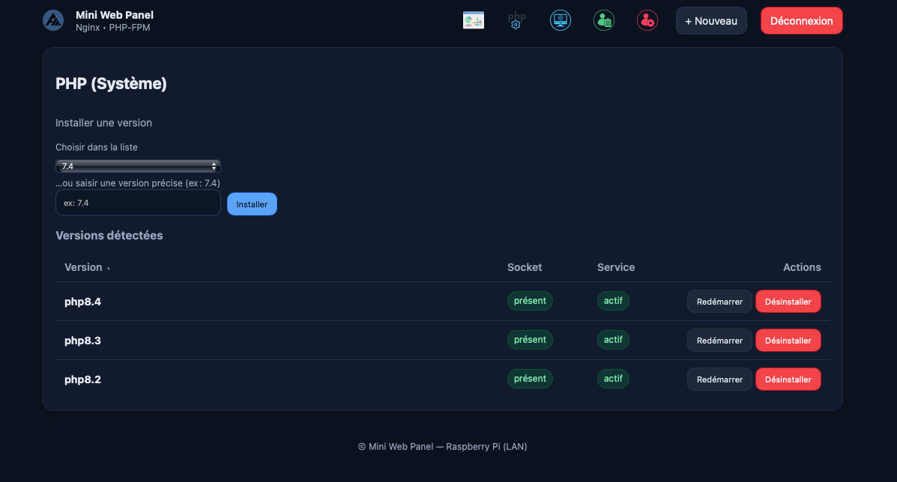

### Gestion des sites
- Liste des sites  
  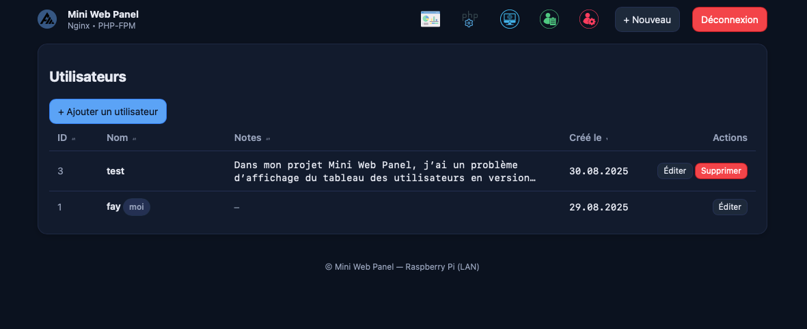
- Nouveau site (création réussie)  
  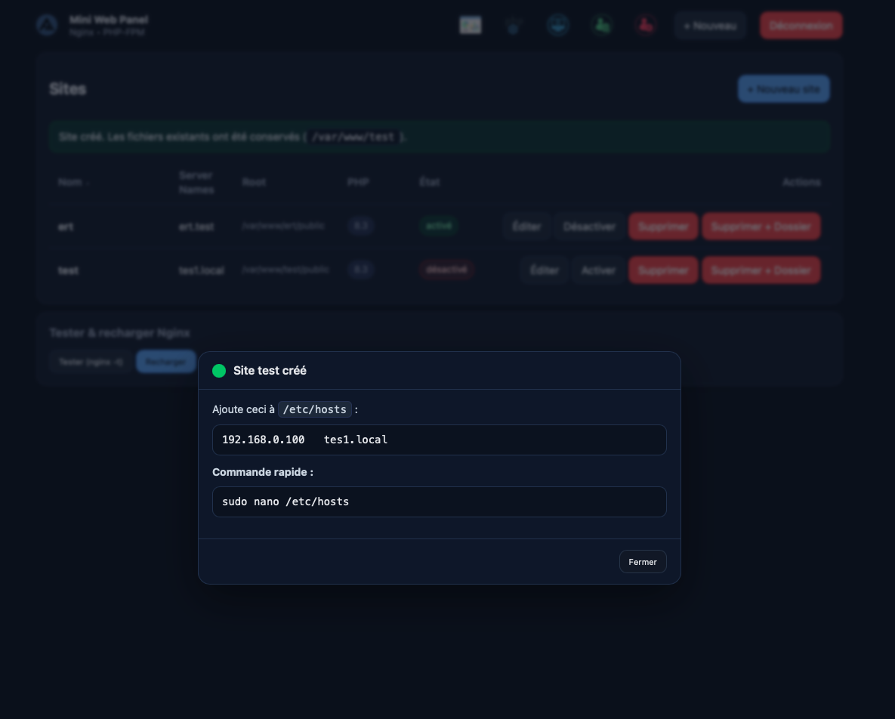
- Nouveau site (erreur validation)  
  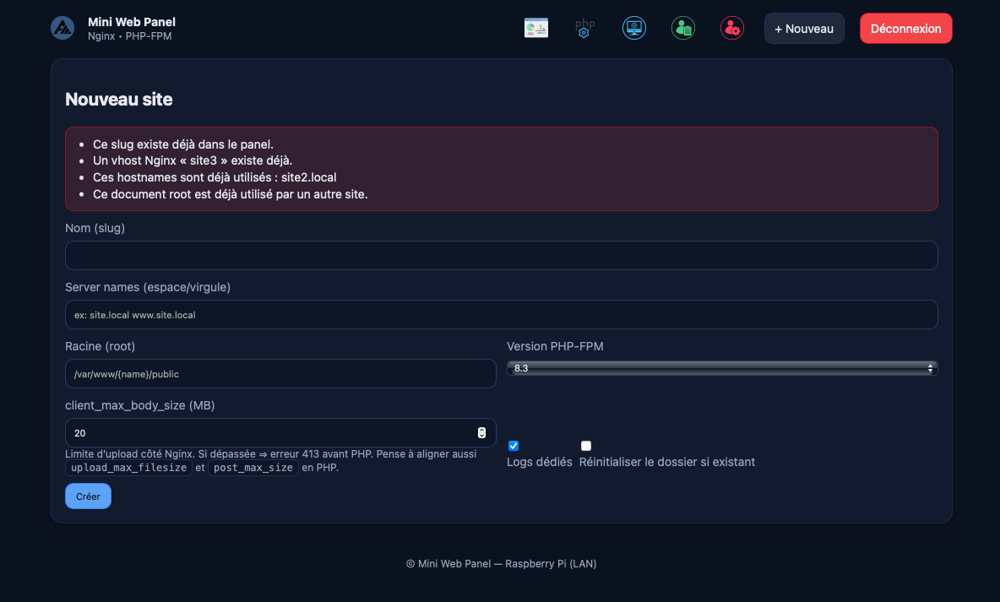
- Suppression d’un site  
  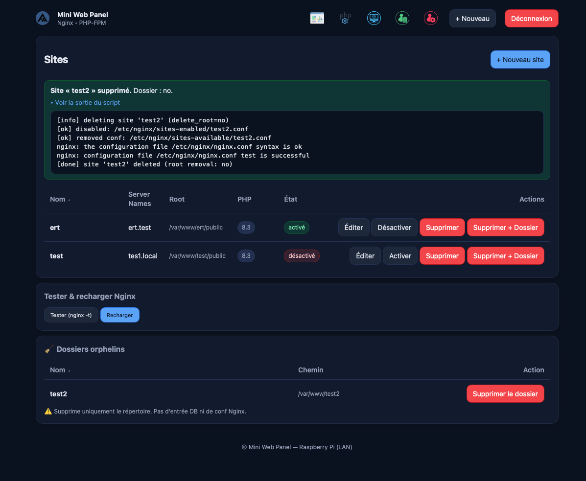
- Test & reload Nginx  
  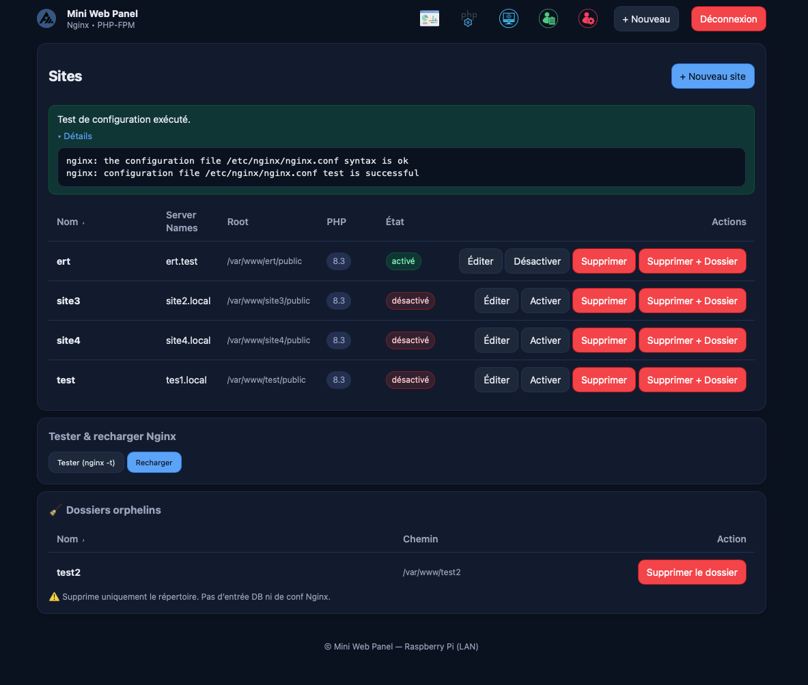

### Gestion des utilisateurs
- Liste des utilisateurs  
  
- Édition utilisateur  
  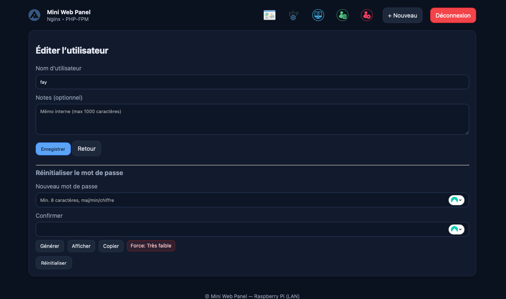
- Édition compte (moi)  
  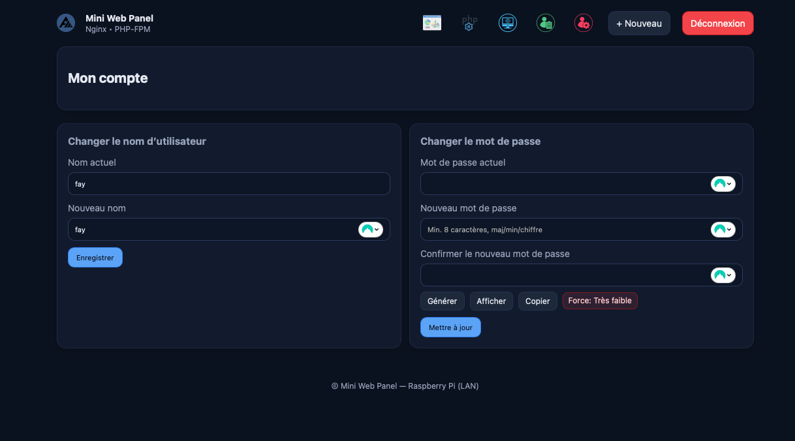

### Système
- Redémarrage/Arrêt via POST `/system_power.php` (compat)  
  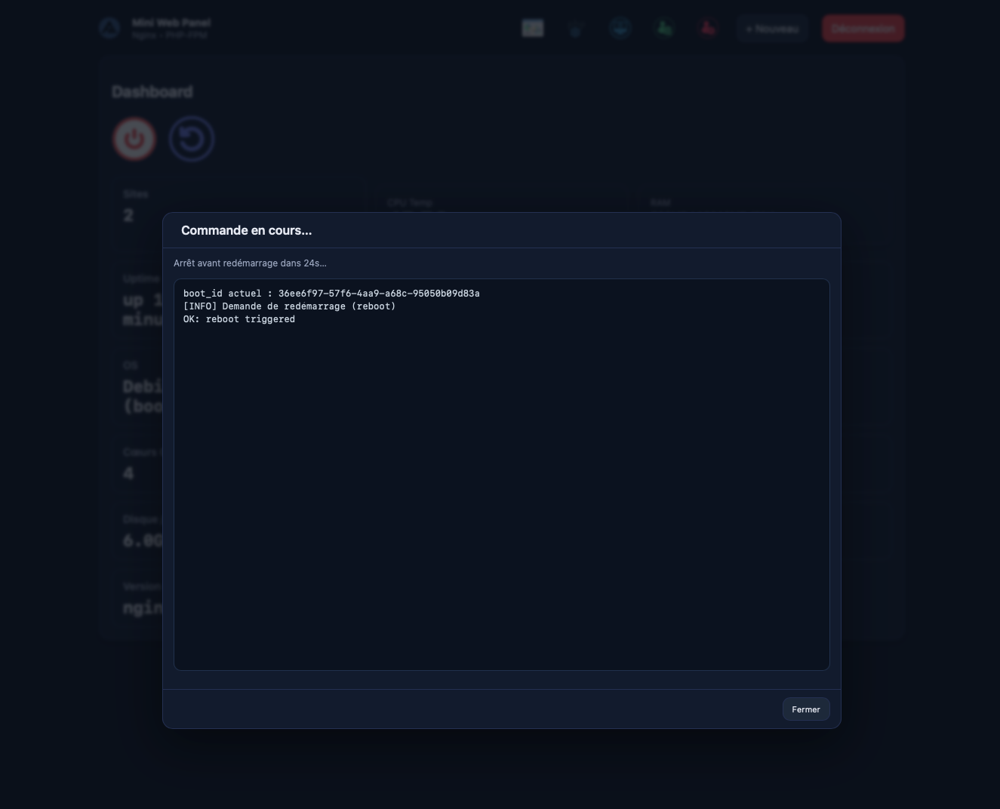
---

## 🗺️ Roadmap (extraits)
- [ ] Backup/restore vhosts
- [ ] Export logs d’audit
- [ ] Mode lecture seule
- [ ] Gestion avancée multi-users (rôles)

### Migration MVC (résumé)
- [x] Users + PhpManage modules migrés en MVC
- [x] Sites: contrôleur, vues, service, routes (incl. orphelins, supprimer+dossier)
- [x] Navbar vers /sites et redirections legacy Sites
- [ ] Page Compte `/account` (à faire)
- [ ] Logout via POST CSRF (à faire)
- [ ] i18n: unifier `lang/` vs `locales/`

Voir aussi: docs/todo_mvc.md pour la liste détaillée des manques MVC et les priorités à court terme.

Note: un module "Liaison Domaine ↔ Site (vhost+SSL)" est planifié (DB `domains`, services DomainBinder/DnsProvider, intégration Sites, sécurité/audit, UX). Voir la section 11 de docs/todo_mvc.md.

---

## ⚠️ Limites connues
- Un seul vhost par site (pas encore de reverse proxy complexes)
- Pas de rollback automatique sur erreur Nginx
- Auth simple SQLite (à utiliser sur LAN sécurisé)

---

## 📄 Licence
Projet privé/démonstration. Adapter selon vos besoins.  
